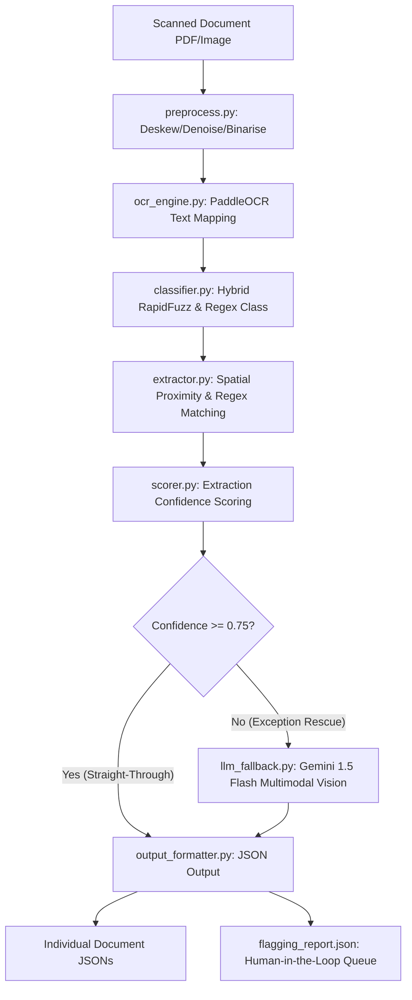

# 🌟 IntelliDocs AI Platform

IntelliDocs is an advanced, enterprise-grade Intelligent Document Processing (IDP) and Retrieval-Augmented Generation (RAG) platform. It provides high-performance OCR ingestion, deterministic layout-based field extraction, multimodal exception handling (LLM Fallbacks), and context-aware document RAG assistant capabilities.

---

## 🏗️ Architectural Overview



---

## 🚀 Getting Started

### 1. Installation & Environment Setup
Clone the repository and prepare the virtual environment:
```bash
# Navigate to the platform directory
cd desicrew_platform

# Activate the virtual environment
venv\Scripts\activate

# Install all dependencies (if not already completed)
pip install -r requirements.txt
```

### 2. Configure API Credentials
Create `.streamlit/secrets.toml` at the project level to store your API keys:
```toml
[gemini]
api_key = "YOUR_GEMINI_API_KEY"

[openai]
# If using OpenAI fallbacks or embeddings
api_key = "YOUR_OPENAI_API_KEY"
```

---

## 🛠️ Pipeline Modules (Task 3)

### 1. Pre-Processing (`preprocess.py`)
- **DPI Scaling**: Converts source PDFs to 300 DPI to maintain high visual fidelity.
- **Deskewing**: Estimates text rotation using `deskew.determine_skew` and corrects rotation dynamically.
- **CLAHE Enhancement**: Standardizes document illumination.
- **CLAHE & Otsu Binarisation**: Standardizes image lighting, filters noise via `cv2.fastNlMeansDenoising`, and applies threshold binarization to maximize OCR parser clarity.

### 2. OCR Engine (`ocr_engine.py`)
- Standardizes token mapping and positional coordinates using PaddleOCR.
- Implements a natural reading-order layout grouper (with a 15-pixel line-height cluster bounding box threshold).

### 3. Hybrid Classifier (`classifier.py`)
- Employs deterministic anchor phrase searches (`RapidFuzz` Token-Set Ratio) combined with class-specific regular expressions.
- Routes documents straight-through, or flags them for validation failure.

### 4. Field Extractor (`extractor.py`)
- Leverages spatial coordinates and proximity boundaries to parse unstructured layouts.
- **Horizontal Proximity**: Extracts text directly to the right of an anchor.
- **Vertical Proximity**: Isolates closest elements vertically below an anchor and handles natural reading-order sorting.

### 5. Confidence Scorer (`scorer.py`)
- Computes extraction confidence based on method type and raw OCR quality metrics:
  - `REGEX_BASE_SCORE = 1.0`
  - `SPATIAL_BASE_SCORE = 0.95`
- Clamps scores to `[0.0, 1.0]` and flags fields falling below the acceptable `0.75` threshold.

### 6. Exception Fallback Rescue (`llm_fallback.py`)
- Intercepts low-confidence or failed fields and routes the preprocessed image directly to `gemini-1.5-flash` using multimodal vision.
- Standardizes output expectations to structured JSON and marks successfully rescued values with `llm_fallback` method and a `0.90` confidence score.

### 7. Output Formatter (`output_formatter.py`)
- Consolidates classifications and field extractions into production-ready schemas.
- Separates high-confidence, fully automated executions (Straight-Through Processing) from exceptions requiring manual human auditing by compiling a central `flagging_report.json`.

---

## 📊 Document Assistant (Task 2)
An intelligent, document-aware assistant featuring:
- **Maximal Marginal Relevance (MMR)** retrieval to reduce redundant context.
- **Semantic Topic Switch Detection**: Prevents carry-over context during conversational shifts.
- **Referential Pronoun Detection**: Bypasses topic resets on follow-ups (e.g. *"Can you explain that more simply?"*).
- **Presentation-Layer 1-Indexing**: Transparently maps 0-indexed database records to human-friendly 1-indexed UI listings.

---

## 🧪 Running Tests & Pipelines

### Run Scorer and Formatter Unit Tests
```bash
python -c "import sys; sys.path.append('desicrew_platform'); import unittest; unittest.main(module='test_scorer_formatter')"
```

### Run Entire Document Extraction Pipeline
```bash
python desicrew_platform/task_3_test_ocr.py
```

### Start Master Enterprise AI & IDP Suite Hub
```bash
streamlit run desicrew_platform/main_hub.py
```

### Start RAG Document Assistant Interface
```bash
streamlit run desicrew_platform/task2_rag_assistant/app.py
```

### Start Task 3 Document Extraction Dashboard
```bash
streamlit run desicrew_platform/task3_doc_pipeline/app.py
```
