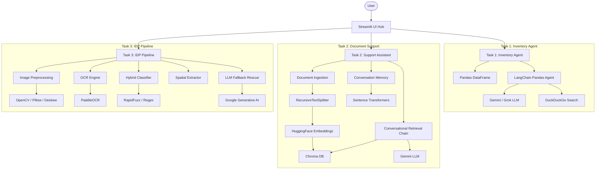

# Desicrew AI Platform - Design Choices

## 1. Overall Platform Architecture
The Desicrew AI Platform is a comprehensive Streamlit-based suite composed of three distinct modules:
1. **Task 1: Autonomous Inventory Analytics Agent (Excel Data Agent)**
2. **Task 2: Context-Aware Document Support Assistant (RAG Assistant)**
3. **Task 3: Intelligent Document Processing (IDP) Pipeline**

### Platform Architecture Diagram

## 2. Global Library Ecosystem
Here is the list of all major libraries and their explicit roles in the platform:

**UI & Core Framework**
- `streamlit`: The overarching web framework for rendering the Hub and all task UIs.

**Data Analysis (Task 1)**
- `pandas`: Used to load, clean, and manipulate the Excel datasets.
- `openpyxl` & `xlrd`: Engines required by pandas to read `.xlsx` and `.xls` files respectively.

**Agent & LLM Orchestration (Task 1 & 2)**
- `langchain`, `langchain-community`, `langchain-experimental`, `langchain-google-genai`: The orchestrator for the Excel Pandas Agent, web search integrations, and the RAG (ConversationalRetrievalChain).
- `duckduckgo-search` (`ddgs`): The underlying tool for web-search capabilities in the Pandas Agent.
- `google-generativeai`: Direct API access used for the Gemini 1.5 Flash multimodal fallback in Task 3.

**Document Loading & Embeddings (Task 2)**
- `pypdf`, `pymupdf`: PDF loading and text extraction.
- `docx2txt`: Loading and extracting text from Word documents.
- `sentence-transformers`: Used for HuggingFace embeddings (`all-MiniLM-L6-v2`) in both the vector store and to encode chat history for topic-switch detection.
- `chromadb`: The vector database used for persisting and querying document chunks.

**Image Processing & OCR (Task 3)**
- `paddleocr`, `paddlepaddle`: The core engine used to extract bounding boxes and text from document images.
- `opencv-python-headless`: Used for image binarization, deskewing, and general pre-processing.
- `pdf2image`: Used to convert uploaded PDF documents into PIL images before processing.
- `Pillow` (PIL): Standard Python image manipulation (resizing, format conversions).
- `deskew`: Specifically used to detect document rotation angles and correct skew.
- `rapidfuzz`: Used for fuzzy string matching in the hybrid classifier to determine document type.

## 3. Workflows & Library Connections

### Task 1: Autonomous Inventory Analytics Agent
**Workflow:**
1. **File Upload:** The user uploads an Excel file via `streamlit`. `pandas` (using `openpyxl`/`xlrd`) reads it into a DataFrame.
2. **Agent Initialization:** `langchain-experimental` wraps the DataFrame into a `create_pandas_dataframe_agent`. 
3. **Execution:** The agent formulates Python (AST) execution steps by calling the `gemini` LLM (via `langchain-google-genai`). If external information is needed, it triggers the `WebSearch` tool (`duckduckgo-search`).
4. **Fallback:** If a quota error occurs, a fallback LLM is initiated to gracefully continue execution.

### Task 2: Context-Aware Document Support Assistant
**Workflow:**
1. **Ingestion:** User uploads `.pdf`, `.docx`, or `.txt`. Langchain loaders (`PyMuPDFLoader`, `Docx2txtLoader`, `TextLoader`) extract the text. `RecursiveCharacterTextSplitter` chunks it.
2. **Embedding & Storage:** `langchain-community` uses `HuggingFaceEmbeddings` (powered by `sentence-transformers`) to convert chunks into vectors, which are saved to `Chroma` DB.
3. **Topic Switching:** When a user asks a question, `sentence-transformers` checks cosine similarity between the current and previous query to detect context shifts.
4. **Retrieval & Answer:** If no shift is detected, `ConversationalRetrievalChain` queries `Chroma` for relevant context, and `langchain` prompts the LLM to generate a cited response.

### Task 3: Intelligent Document Processing (IDP) Pipeline
**Workflow:**
1. **Pre-processing:** The uploaded image/PDF is converted to a PIL image (via `pdf2image`), converted to grayscale, deskewed (via `deskew` & `opencv`), and binarized for clarity.
2. **OCR Extraction:** The cleaned image is passed to `PaddleOCR` to extract text tokens and spatial bounding boxes.
3. **Classification:** All tokens are concatenated. `rapidfuzz` performs a fuzzy string match against class anchors, and regex confirms the document signature.
4. **Field Extraction:** Spatial heuristics run over the bounding boxes to extract fields deterministically.
5. **LLM Rescue:** If fields are missing or have low confidence, the original pre-processed PIL image is sent directly to Gemini 1.5 Flash via `google-generativeai` to rescue the fields.
6. **Serialization:** Final structured JSON and review flagging are rendered in `streamlit`.

# shared/llm.py

## Role in the Project
In a Modular AI Platform, you want to avoid initializing your LLM clients inside every single feature script. If you decide to change models, update an API endpoint, or switch from a cloud provider to a local provider, doing it in multiple places introduces major bugs and code duplication.

shared/llm.py acts as the central nervous system for model access. By providing a single, standardized factory function (get_llm()), all three applications—the Excel Data Agent, the RAG Assistant, and the Document Extraction Pipeline—import this unified interface. This design abstracts away backend complexity and ensures uniform generation settings (like creativity controls) across the entire codebase.

The Switch/Fallback Comment: The initial block outlines a clean migration path. If you transition from cloud inference to a completely local setup, you only need to swap two lines here using ChatOllama(model="mistral"), instantly routing the entire multi-app suite to your local hardware.

# shared/embeddings.py
### Role in the Project
This file is the mathematical core for Task 2 (Document-aware Support Assistant). Before your RAG (Retrieval-Augmented Generation) chatbot can search through PDFs, the text needs to be translated into a format a computer can understand (numbers). This utility handles that translation. By keeping it in the shared/ folder, you also leave the door open for Task 3 to use embeddings for document classification later on.

### Core Architectural & AI Theory
The Singleton Pattern: This is the most important concept in this file. Loading a machine learning model into memory takes time and consumes RAM. If your Streamlit app re-loaded this model every time a user asked a question, the app would crash or freeze. The Singleton pattern ensures the model is loaded exactly once and reused globally.

Why all-MiniLM-L6-v2?: You specifically chose this model because it is the industry standard for local, fast, and free embeddings. It generates 384-dimensional vectors, which are small enough to process rapidly on a CPU but dense enough to capture deep semantic meaning.

# task 3 
In Intelligent Document Processing (IDP), this is called Straight-Through Processing (STP) with AI Exception Handling. By using deterministic rules (Regex/Spatial) for 80% of the documents and only routing the failed 20% to Gemini, you get the best of both worlds: lightning-fast processing, near-zero hallucination risk for standard fields, and drastically lower API compute costs, while still saving human operators from manual data entry.